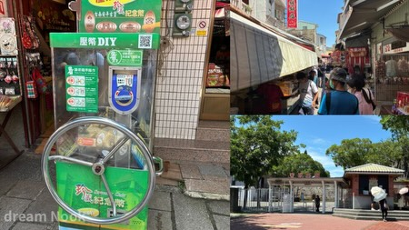
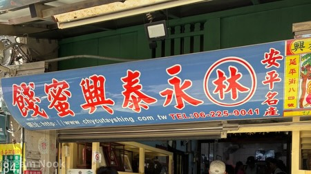
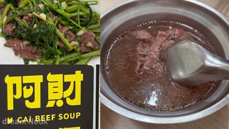
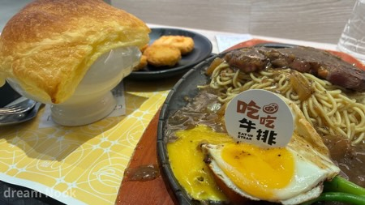
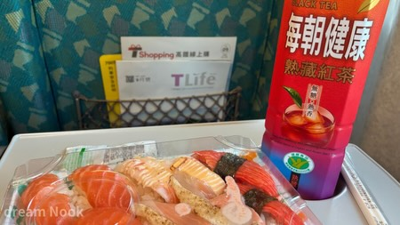

台北🌧️｜台南🌤️

<i class="bi bi-geo-alt-fill"></i> 租車：詠心同行\
<small>台南火車站出來對面</small>

<i class="bi bi-geo-alt-fill"></i> 住宿：康橋商旅 台南赤崁樓館\
<small>機車停車場在後方</small>

 

有早餐也有晚餐，食物也很好吃。

寄放完行李就去 #安平老街 走走。

機台上有貼提醒「先選圖案再投幣」\
我太興奮沒看到😅😅

- - -

### 當地商家推薦的蜜餞行

<i class="bi bi-geo-alt-fill"></i> #永泰興蜜餞

### 午餐

此行的最大目的就是去看 #慕夏百年經典特展。

儘管一直被快門聲干擾，\
但還是有點收穫，\
會反思自己。

### 返程

返程時去了 #葡吉麵包店，\
買新鮮剛出爐的麵包。

還車後，\
離高鐵發車還有一段時間，\
先去台南高鐵站附近的 OUTLET 逛逛，\
順便吃點東西。

<small>酥皮濃湯好好喝</small>

帶壽司在高鐵上吃。

<small>久違的爭鮮＋每朝健康紅茶</small>

- - -

結束兩天一夜台南輕旅行🚄
