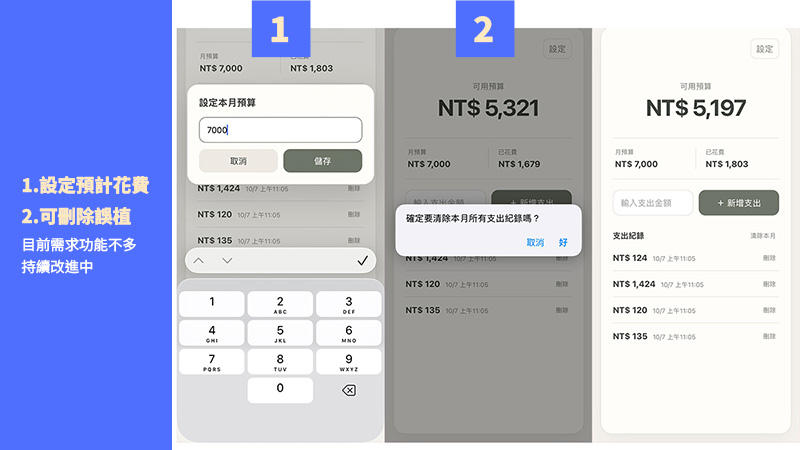

## 為什麼想做「月結餘小工具」？

平常有使用記帳APP

雖然可以知道自己把錢花去哪裡

但卻是把錢花完

反省後

決定先控制自己可花費的金額

所以需要一個小工具

在記錄花費後

告知自己還有多少金額可以使用

 <a href="https://www.google.com" target="_blank" rel="noopener noreferrer">月結餘小工具｜還可以花多少</a>

